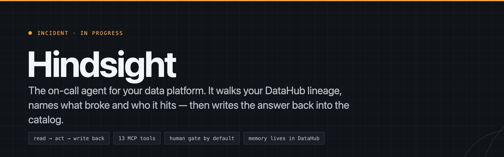
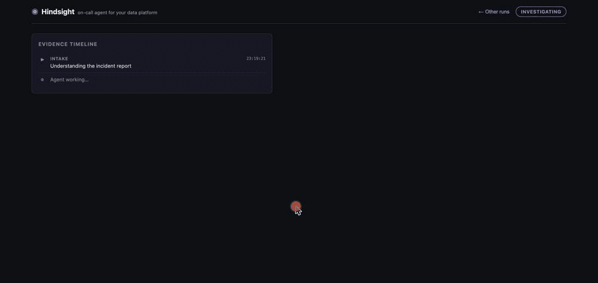
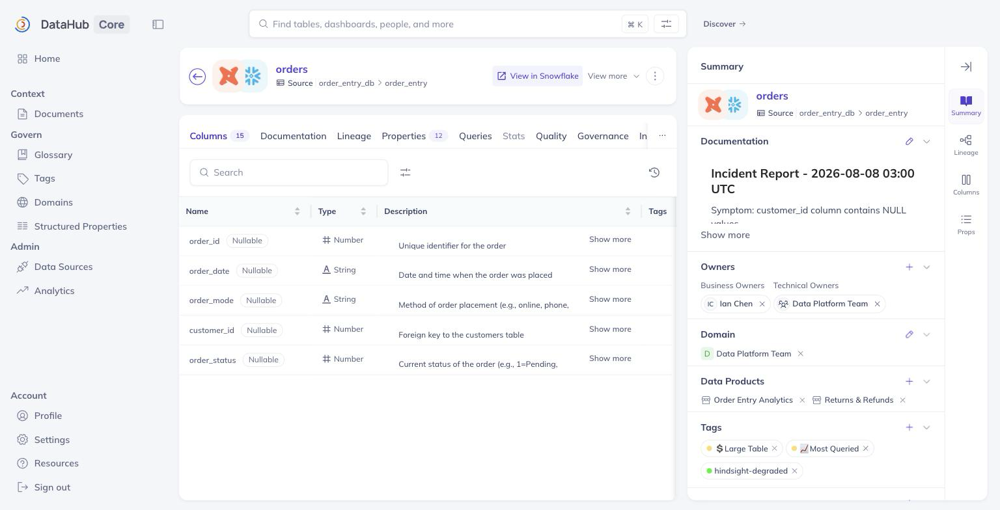
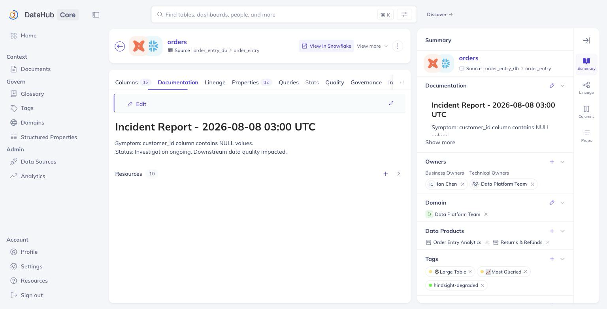
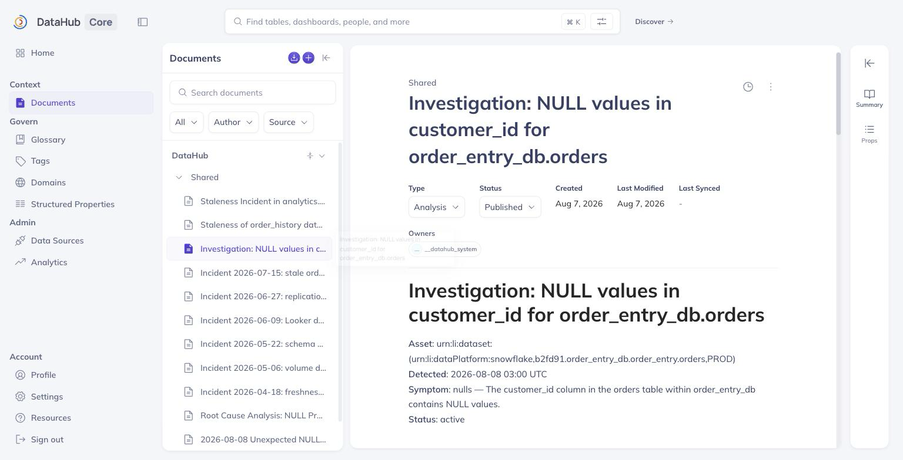
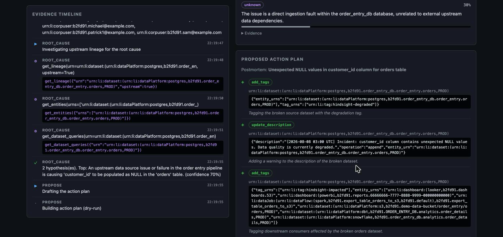
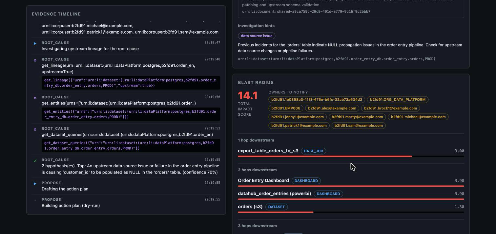
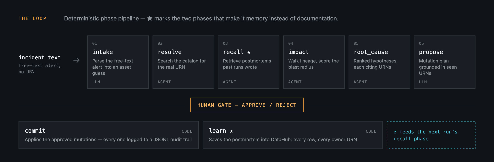
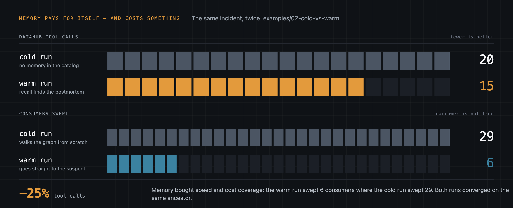

<p align="center">
  
</p>

<p align="center">
  <a href="LICENSE"></a>
  <a href="backend/pyproject.toml"></a>
  
  
</p>

---

**Your dashboard has been wrong since 03:00.** Hindsight already knows what broke it, who it hits, and writes the answer back into the catalog — so the next incident starts where this one ended.

It takes a free-text alert, walks the DataHub lineage graph to rank who is affected, proposes a root cause backed by incidents you already solved, and files the postmortem *inside DataHub*. Built for the [Build with DataHub: The Agent Hackathon](https://datahub.devpost.com/), track *Agents That Do Real Work*.

<table>
<tr>
<td width="33%"><b>Read</b><br>Multi-hop lineage both directions, schema, query history — and the postmortems previous runs left behind.</td>
<td width="33%"><b>Act</b><br>Deterministic blast-radius scoring, ranked hypotheses that must cite a URN a tool actually returned, and a mutation plan with a rationale per change.</td>
<td width="33%"><b>Write back</b><br>Tags, an incident banner, ownership, and a postmortem document — all in the catalog, not a side database.</td>
</tr>
</table>

### An agent that reports its own success proves nothing

So it doesn't. Two commands close that hole, and neither needs you to take the agent's word for it:

```bash
cd backend && .venv/bin/hindsight verify ../examples/01-schema-drift    # → verified 5/5
```

`verify` re-reads every mutation in a run's audit log straight from DataHub **through the GMS GraphQL API — not the MCP tools that wrote it** — and exits non-zero if anything is missing. It has already caught a real defect: [`examples/02-cold-vs-warm/cold/verify.txt`](examples/02-cold-vs-warm/cold/verify.txt) reports `verified 5/6`, and the failure is a second run silently overwriting the first one's incident banner. Every run had reported success. The failing file ships as it came out.

```bash
cd backend && .venv/bin/hindsight replay ../examples/02-cold-vs-warm/warm    # no DataHub, no API key
```

`replay` reprints a captured run from its raw event stream — [`events.json`](examples/02-cold-vs-warm/warm/events.json). Clone the repo and watch a real investigation without installing anything.

<p align="center">
  
</p>

### Start here

| | |
| --- | --- |
| **Try it without installing** | [The hosted demo](https://gmassello.github.io/hindsight/) — replays a captured investigation in the browser: evidence timeline, ranked blast radius, the approval gate |
| **See the memory loop pay off** | [`examples/02-cold-vs-warm`](examples/02-cold-vs-warm) — the same incident, 20 tool calls cold vs. 15 warm |
| **See it do real work** | [`examples/01-schema-drift`](examples/01-schema-drift) — 14 tool calls, 16 consumers, 10 owners paged, postmortem filed, `verified 5/5` |
| **See it work without our code** | [`examples/04-skill-portability`](examples/04-skill-portability) — the same procedure as a portable Agent Skill, [proposed upstream](https://github.com/datahub-project/datahub-skills/pull/110) |

---

## The 60-second run

```bash
# 1. Local DataHub with sample lineage  (needs Docker: 4 CPU / 8 GB)
uv tool install acryl-datahub
datahub docker quickstart                    # UI at localhost:9002 — datahub/datahub
datahub datapack load showcase-ecommerce     # then WAIT — see the note below

# 2. Backend
cd backend && uv sync
cp ../.env.example .env                      # set GEMINI_API_KEY (or anthropic / bedrock)

# 3. Investigate
.venv/bin/hindsight investigate \
  "orders table in order_entry_db is showing nulls in customer_id since 03:00 UTC today"
```

The CLI streams the timeline, renders the mutations as a dry-run diff, and applies them once you approve.

> **`datapack load` returns before the lineage graph exists.** Ingestion reports success in under a second while the index fills in for minutes. A run started too early produces a real-looking investigation with a blast radius that is quietly wrong.

**Then run it again.** The second run's `recall` phase finds the postmortem the first one wrote and starts from its conclusions. That is the whole point.

<details>
<summary><b>Web UI, Docker and the API</b></summary>

```bash
cd backend && .venv/bin/hindsight serve      # FastAPI on :8000
cd frontend && npm install && npm run dev    # Vite on :5173
```

A single-page React app: submit an incident, watch the evidence timeline stream over SSE while panels fill in per phase — resolved asset, "we've seen this before", ranked blast radius, hypotheses with confidence bars, and the action plan as a diff with **Approve / Reject**. Set `VITE_API_URL` in `frontend/.env` if the API is elsewhere.

One command instead, with the DataHub quickstart already up:

```bash
GEMINI_API_KEY=<your-key> docker compose up --build
```

API surface: `POST /investigations` · `GET /investigations/{id}/stream` (SSE, up to the human gate) · `POST /investigations/{id}/approve` · `POST /investigations/{id}/reject`.

Prerequisites: Python 3.13+, [uv](https://docs.astral.sh/uv/), Node 20.19+. On colima, `colima start --cpu 4 --memory 8`. Every knob is in [`docs/configuration.md`](docs/configuration.md).

</details>

---

## What it actually leaves behind

Not a mock-up — DataHub's own UI after a run, and the app driving it.

<table>
<tr>
<td width="50%"><br><sub><b>The tag.</b> <code>hindsight-degraded</code> on the broken asset — and evidence for the next run's upstream-incident hypothesis.</sub></td>
<td width="50%"><br><sub><b>The banner.</b> Every consumer who opens the asset sees the incident at the top of the description.</sub></td>
</tr>
<tr>
<td width="50%"><br><sub><b>The postmortem.</b> A catalog document, not a side database — this is what <code>recall</code> retrieves next time.</sub></td>
<td width="50%"><br><sub><b>The human gate.</b> The plan as a dry-run diff, with a rationale per mutation.</sub></td>
</tr>
</table>

<details>
<summary>The live investigation view</summary>



</details>

---

## How it works



Five decisions carry the design:

- **Memory before investigation.** `recall` runs *before* `impact` and `root_cause`, and what it finds becomes `investigation_hints` that steer where the search looks first. Memory drives the investigation instead of decorating it.
- **Per-phase toolsets.** Investigation phases only ever see read tools; mutation tools exist only in `commit`/`learn`. The model cannot write while it should be reading.
- **All math and writes are code.** The LLM reports facts; the score is a formula and the mutations execute in code with an audit log. `impact(consumer) = type_weight × 1/(1+hops) × owner/criticality/domain multipliers`.
- **Grounded hypotheses, and a verdict that can decline.** Every hypothesis must cite a URN a tool actually returned. An `exonerated` verdict forces the action plan empty *in code*, not by asking the model nicely.
- **Grounded mutations only.** `propose` sees the live mutation schemas and a whitelist of URNs the investigation saw. A mutation it cannot ground in a real URN is dropped, not guessed.

Plus a human gate by default (`--auto-approve` opts out), a deterministic state machine rather than a free ReAct loop, and MCP-first DataHub access via [`mcp-server-datahub`](https://github.com/acryldata/mcp-server-datahub) with a GMS GraphQL fallback per mutation. Full rationale in [`docs/design.md`](docs/design.md).

---

## Why memory is the feature



A later run benefits from the write-back directly: an ancestor already tagged `hindsight-degraded` is *evidence* for the upstream-incident hypothesis. The system reads its own past actions.

And it is not free. The warm run was cheaper **and narrower** — 6 consumers swept against the cold run's 29. Both converged on the same ancestor, but a warm run trusts memory instead of re-deriving the blast radius. That tradeoff is the honest version of this graph.

### What gets written, and who inherits it

| Mutation | Where it lands | Who inherits it |
| --- | --- | --- |
| `add_tags` `hindsight-degraded` | Tags on the broken asset | Anyone who opens or searches it — and the next run, as evidence |
| `add_tags` `hindsight-impacted` | Tags on the top-scoring consumers | Downstream owners, through search facets |
| `update_description` | Incident banner atop the asset description | Every consumer who opens the asset in the UI |
| `add_owners` | Ownership on an ungoverned asset in the path | The governance backlog, permanently |
| `set_domains` | Domain assignment | Implemented, never triggered — see [Honest limits](#honest-limits) |
| `save_document` | A postmortem document in the catalog | The **next** investigation's `recall` phase |

### Not what DataHub already gives you

| DataHub gives you | Hindsight adds |
| --- | --- |
| Impact Analysis lists downstream entities | A ranking over them by a deterministic score, and the deduplicated owner list you actually have to page |
| A lineage graph you can walk by hand | An agent that walks it both directions from a free-text alert and cites the URNs behind each hypothesis |
| Documents you can write | A postmortem the next investigation *retrieves and acts on* — memory, not documentation |

---

## Every claim, and where to check it

Every number above comes from a file in this repository.

| Claim | Evidence |
| --- | --- |
| 13 MCP tools, read **and** mutation, multi-hop lineage both directions | [`02-cold-vs-warm/cold/timeline.md`](examples/02-cold-vs-warm/cold/timeline.md) — 20 tool calls, 29 consumers |
| Blast radius ranked by a deterministic formula, with the owner list to page | [`02-cold-vs-warm/cold/blast-radius.md`](examples/02-cold-vs-warm/cold/blast-radius.md) — total score 30.08, 14 deduplicated owners |
| The same incident costs **20 tool calls cold and 15 warm** — and sweeps 29 consumers vs. 6 | [`02-cold-vs-warm/`](examples/02-cold-vs-warm) |
| Every mutation re-read through a **second channel**, GraphQL rather than the MCP tools that wrote it | [`01-schema-drift/verify.txt`](examples/01-schema-drift/verify.txt) — `verified 5/5` |
| Verification catches what the agent misses | [`02-cold-vs-warm/cold/verify.txt`](examples/02-cold-vs-warm/cold/verify.txt) — `verified 5/6`, the banner overwritten |
| Five runs against a live catalog across four directories | [`examples/`](examples) |
| The procedure runs with **no Hindsight code in the loop** — same URN, converging root cause, **the same fourteen owners, set for set** | [`04-skill-portability/`](examples/04-skill-portability) |
| The skill is proposed upstream to the official DataHub skills repo | [datahub-project/datahub-skills#110](https://github.com/datahub-project/datahub-skills/pull/110) |

<details>
<summary><b>The five captured runs, one row each</b></summary>

`scenarios/scenarios.yaml` defines three reproducible scenarios; `examples/` holds five captured runs across four directories, each with its input, timeline, blast radius, postmortem and audit log. Four were written by `hindsight investigate ... --report <dir>` and ship their raw event stream; the fifth is a run of the Skill alone, transcribed by hand.

| Run | Tool calls | Consumers | Impact score | Deduped owners | `verify` |
| --- | --- | --- | --- | --- | --- |
| `01-schema-drift` | 14 | 16 | 17.0 | 10 | `verified 5/5` |
| `02-cold-vs-warm/cold` | 20 | 29 | 30.08 | 14 | `verified 5/6` |
| `02-cold-vs-warm/warm` | 15 | 6 | 17.55 | 6 | `verified 8/9` |
| `03-orphaned-asset` | 17 | 0 (leaf asset) | 0.0 | none | `verified 4/4` |
| `04-skill-portability` | 9 investigation (14 total) | 30 | 26.23 | 14 | — |

1. [`01-schema-drift`](examples/01-schema-drift) — a simulated upstream migration drops the `customer_id` NOT NULL constraint; the agent traces the nulls to a Postgres ancestor a previous run had already tagged `hindsight-degraded`.
2. [`02-cold-vs-warm`](examples/02-cold-vs-warm) ★ — the same incident twice, timelines side by side.
3. [`03-orphaned-asset`](examples/03-orphaned-asset) — a stale table nobody owns and nobody consumes; the agent assigns `add_owners` to close the governance gap.
4. [`04-skill-portability`](examples/04-skill-portability) — scenario 1 re-run by the Skill alone, no Python in the loop.

`scenarios/seed_incidents.py` loads six resolved historical postmortems so `recall` has memory to work with.

</details>

---

## The workflow as a portable Skill

[`.agents/skills/datahub-incident-triage/`](.agents/skills/datahub-incident-triage) distills the agent into an [Agent Skills](https://skills.sh) package: the same seven-step procedure as plain instructions, no Python. Any Agent-Skills CLI with DataHub connected gets the behaviour without cloning this repo.

It has been run end to end — [`examples/04-skill-portability`](examples/04-skill-portability) reaches **the same fourteen owners, set for set**, and names scenario 1's conclusion as its own second hypothesis. Caveats and the three defects verification surfaced are documented there.

---

## Honest limits

- **The phase prompts are not covered by tests.** Everything under [Tests](#tests) is; the prompts are verified only by the captured runs.
- **Every number in `examples/` comes from a single run.** 20 → 15 is one pair against one catalog, not a measurement with a variance.
- **Memory bought speed and cost coverage.** The warm run swept 6 consumers where the cold run swept 29. Faster is not the same as more thorough.
- **`propose` is not deterministic.** Scenario 3 run twice produced `add_owners` once and not the other time, on an asset that demonstrably had no owner.
- **The `exonerated` verdict has never fired.** Exonerating requires evidence of *health*, and this catalog carries no freshness timestamps, no row counts and no job run history. The verdict is implemented and untriggerable here.
- **Two runs against the same asset overwrite each other's incident banner.** Found by `verify`, not by the author — [`02-cold-vs-warm/cold/verify.txt`](examples/02-cold-vs-warm/cold/verify.txt), `verified 5/6`.
- **Hindsight does not detect incidents.** It receives an alert and investigates it. Monitoring is one of the six items in the out-of-scope table of [`docs/design.md`](docs/design.md) §3, *Scope: what is in and what is out*.
- **The API keeps investigations in an in-memory dict** — no auth, no persistence. Restarting loses them. This is a demo, not a SaaS.
- **`set_domains` has never fired.** Implemented, but the prompt forbids inventing a domain URN and no run retrieved one — the domain URNs in this catalog are UUIDs.
- **Nothing has run against a second catalog.** One warehouse, one datapack.

## Tests

```bash
cd backend
.venv/bin/ruff check src tests
.venv/bin/pytest
```

Unit tests mock the LLM and MCP client. Covered: the scoring formula, the phase loop guards, the Gemini schema normalization, postmortem rendering, the report writer, `verify`, `replay`, and the orchestrator's failure policy.

## Deeper

- [`docs/design.md`](docs/design.md) — the design doc frozen before implementation. Good for the *why*; it describes what was planned, this file describes what was built.
- [`docs/notes-from-the-build.md`](docs/notes-from-the-build.md) — eight traps that cost hours against a real DataHub and a real model, written down so they cost you minutes.
- [`docs/configuration.md`](docs/configuration.md) — every environment variable, and the repo layout.
- [`SUBMISSION.md`](SUBMISSION.md) — delivery status.
- [The overview page](https://gmassello.github.io/hindsight/landing/) — the same story on one page, for linking from outside the repo.

## License

Apache 2.0
